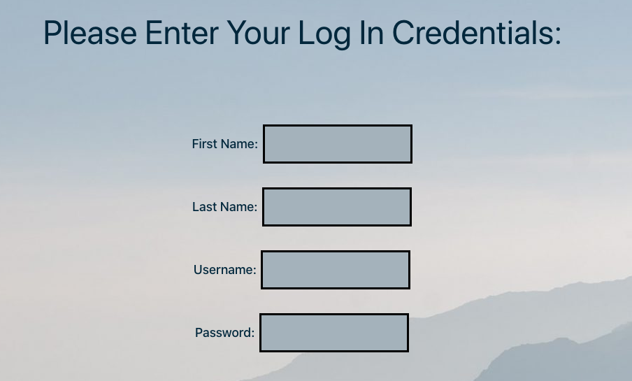

# BLKDG Skills Assessment - Wordpress Form

## Description

A simple form built in PHP that captures a data set and sends it to a mySQL database.

## Table of Contents

- [Video](#video)
- [Installation](#installation)
- [Usage](#usage)
- [Credits](#credits)
- [Future-Development](#future-development)

## Video

## Usage

* This is user-side form.

## Credits & Questions

The base code in this repo is the 'twentytwentyone' WordPress template files. All of the new code is developed in the login-form folder in the loginform.php file by Nora Curcio.

Contact:

- GitHub Username: noracurcio
- LinkedIn Profile: https://www.linkedin.com/in/nora-curcio/

## Future-Development

Future development would include a passsword check the ensure the user entered the correct password and well as a log in functionality that allows checking for encrypted passwords in the database and retreiving them.

## Wordpress

This application is not deployed and was tested using localhost via MAMP.
